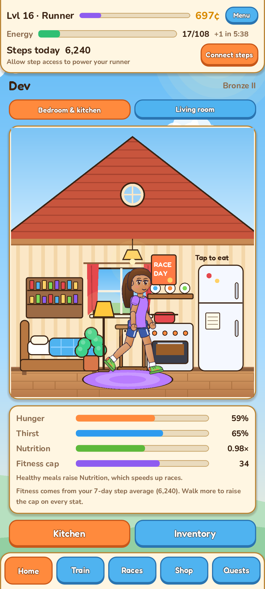
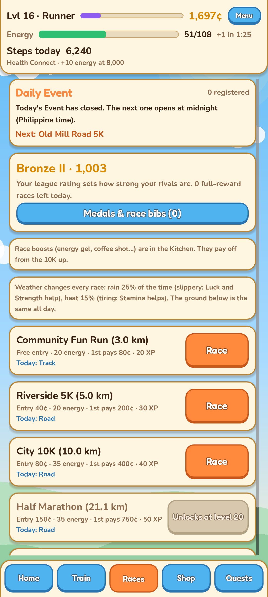
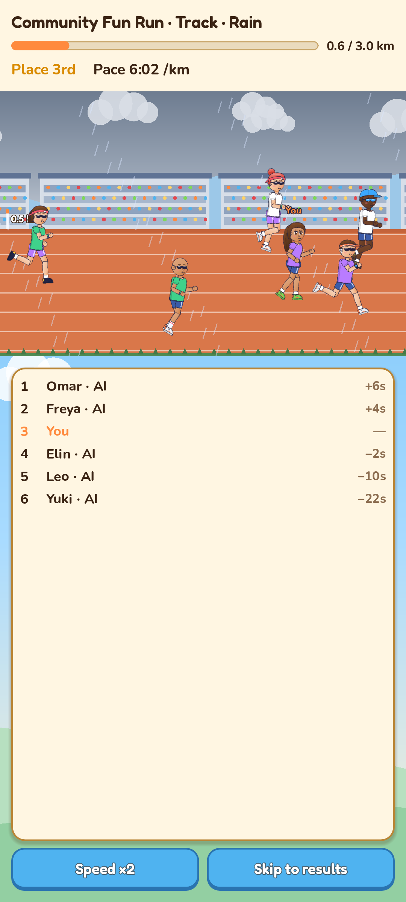
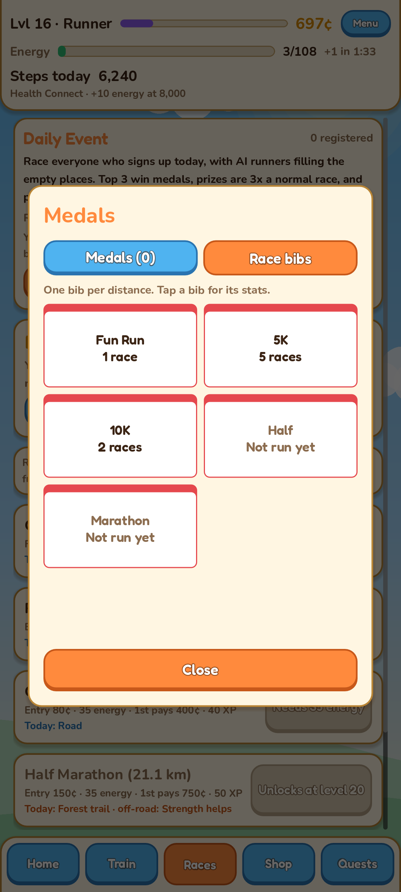
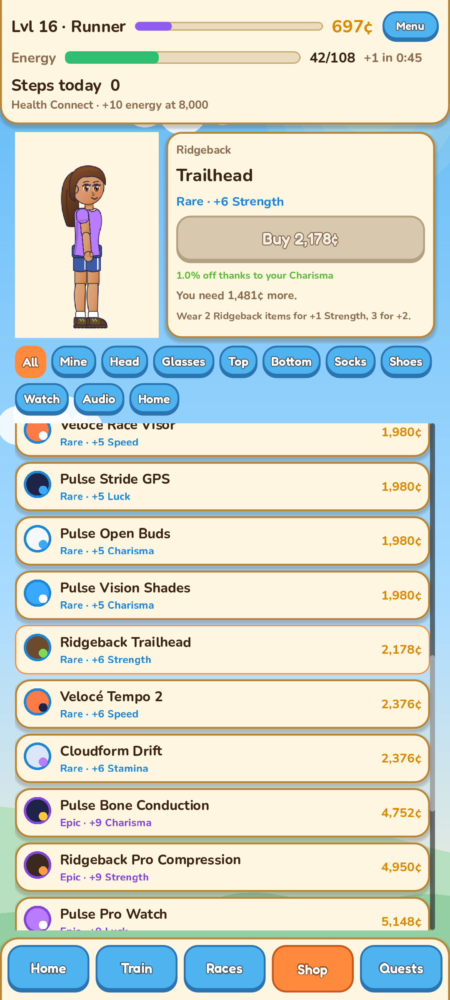

# Runling: your real steps power your runner

A cozy 2D running life-sim for Android by Tabi Studio. Build a runner that
looks like you, feed them, train them and race them against other runners.
The more you walk in real life, the stronger your runner gets.

**[Download the latest version (Google Drive)](https://drive.google.com/drive/folders/1OKRJil2Vq85TlMJgisvNVxiQkPWyds1h?usp=sharing)**
· Latest: **0.9.0** (September 28, 2026) · Android 8.0 or newer, 64-bit phone
· [Runling on the Tabi Studio website](https://lextabi.github.io/tabistudio/runling/)

  
  
  
  
  

> **This is an early test version for friends.** Things will change as the
> game improves, and please tell me about anything that feels off or breaks.

## What's in the game

| | |
|---|---|
| **Your runner** | Pick a body, skin tone, face and one of 10 hairstyles. Everything they wear shows on them |
| **Real steps** | Your daily steps (from Health Connect) set your runner's Fitness, the limit for every stat, and give energy, coins and XP |
| **Care** | Keep your runner fed and hydrated. Tap water and a plain meal are always free, and healthy meals make races faster |
| **Training** | Raise Speed, Stamina, Strength, Luck and Charisma |
| **Races** | From the free Community Fun Run up to the Marathon, against AI runners of your level. Each day brings a new ground (track, road, trail, gravel, mud) and every race rolls its own weather: rain favors Luck and Strength, heat favors Stamina |
| **Daily Event** | Once a day, race everyone who registers (AI runners fill the empty places). Every day has its own name, like *Harbor Lights 10K*, and never repeats for 100 days. Bigger prizes, gear for the podium, and gold, silver and bronze medals with the Event's name and date |
| **Medals and race bibs** | Your Event medals hang on the medal stand at home (tap it to see them all). Each distance has a race bib with your races, podiums, personal best and pace |
| **Jobs and coins** | Part-time jobs (barista, delivery) and race prizes pay for food, gear and furniture |
| **Gear and looks** | Shoes, tops, watches, headphones and more, with rarity glows, outfit sets and dyes. New gear goes on as soon as you buy it |
| **Home** | Your runner potters about the house on their own. Furnish your room (and a living room from level 15): every piece of furniture gives a small perk, like more max energy or extra race XP |
| **Quests** | Daily and weekly quests, a monthly walking milestone and a 28-day login calendar that never resets |
| **Levels and titles** | Rookie to Legend, with exclusive prestige outfits at levels 40 and 50 |

Music and sound effects (switch them off in Menu), and a 30/60 fps setting to save battery.

No ads, nothing to buy, and missed days are never punished.

## How to install

1. On your phone, open the
   [download folder on Google Drive](https://drive.google.com/drive/folders/1OKRJil2Vq85TlMJgisvNVxiQkPWyds1h?usp=sharing) and tap the newest
   `runling_<version>.apk` (the highest number). Tap **Download** (or ⋮ →
   **Download**). Drive may say it can't scan the file for viruses because
   it's large; tap **Download anyway**.
2. Open the downloaded file. If Android asks, allow **Install unknown apps**
   for your browser or file manager.
3. Tap **Install**, then open **Runling**.

## First start

1. **Create an account** with your email and a password. Runling emails you
   a code (from *Runling &lt;tabistudio.dev@gmail.com&gt;*): type it into the
   game. **Check your spam folder** if it doesn't arrive within a minute, and
   mark it "Not spam".
2. **Make your runner.** A short "Getting started" card then shows you how to
   feed them, run your first race and train.
3. **Connect your steps:** tap **Connect steps** at the top and allow
   **Steps** in Health Connect. Health Connect is built into Android 14 and
   newer; on older phones, install
   [Health Connect](https://play.google.com/store/apps/details?id=com.google.android.apps.healthdata)
   from the Play Store first. Your phone counts steps on its own; a fitness
   app or watch that syncs to Health Connect works too.

Forgot your password? Tap **Forgot password?** on the log-in screen and
you'll get a code by email.

## Updating to a new version

Download the new `.apk` and open it. Android shows **Update**: tap it.

Your runner and progress are saved to your account online, not only on the
phone, so they're safe when you update, and you can log in on another phone
too.

## Your data

- Your account (email and password) and your game progress are stored on
  the game's server, so nothing is lost if you change phones.
- Runling reads only your **daily step totals** from Health Connect, and only
  if you allow it. No location, heart rate or other health data.
- No ads, no tracking, and your information is never sold or shared.
- Delete your account and everything in it any time: **Menu → Delete
  account**.
- Full details: [privacy policy](https://lextabi.github.io/tabistudio/runling/privacy.html)
  · [deleting your account](https://lextabi.github.io/tabistudio/runling/delete-account.html)

## Versions

See [CHANGELOG.md](CHANGELOG.md) for what changed in each version.
